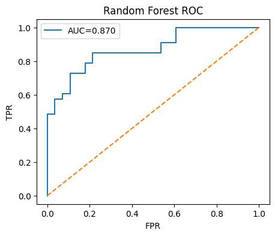

# ❤️ Heart Disease Prediction


## 📌 Project Overview
This project applies machine learning to predict the presence of heart disease based on patient medical attributes.  
The dataset contains 303 rows and 14 columns, including features such as age, sex, blood pressure, cholesterol, chest pain type, max heart rate, and more.  

The goal is to build predictive models and evaluate their performance to determine the best approach for detecting heart disease.

---

## 📊 Steps
1. **Data Understanding & Cleaning**
   - Checked data types, distributions, and outliers.
   - No missing values detected.
   - Outliers in cholesterol were handled during scaling.

2. **Exploratory Data Analysis (EDA)**
   - Explored relationships between features and the target variable (`output`).
   - Key predictors: chest pain type (`cp`), max heart rate (`thalachh`), and ST depression (`oldpeak`).

3. **Feature Engineering**
   - One-hot encoding for categorical features (`cp`, `restecg`, `slp`, `thall`, `caa`).
   - Standard scaling for numerical features (`age`, `trtbps`, `chol`, `thalachh`, `oldpeak`).

4. **Modeling**
   - Logistic Regression (baseline).
   - Random Forest.
   - XGBoost.
   - Hyperparameter tuning applied to Random Forest.

5. **Evaluation**
   - Metrics: Accuracy, Precision, Recall, F1-score, and ROC-AUC.
   - Confusion Matrices and ROC curves visualized.

---

## ⚙️ Results
| Model                | Accuracy | Recall (Class=1) | Precision (Class=1) | F1-score (Class=1) |
|-----------------------|----------|------------------|----------------------|--------------------|
| Logistic Regression   | **0.87** | **0.91**         | 0.86                 | **0.88**           |
| Random Forest (tuned) | 0.77     | 0.85             | 0.74                 | 0.80               |
| XGBoost               | 0.74     | 0.82             | 0.73                 | 0.77               |

- Logistic Regression achieved the best overall performance.  
- Random Forest provided strong recall after tuning.  
- XGBoost was competitive but slightly weaker on this dataset.

---

## 🗂️ Repository Structure
```
heart-disease-prediction/
│
├── heart-disease-prediction.ipynb   # Jupyter notebook with full workflow
├── requirements.txt                 # Required packages
├── README.md                        # Project documentation
├── charts/                          # Visualization images (EDA, Confusion Matrices, ROC curves)
└── models/                          # Saved trained models (optional)
```

---

## 📈 Example Visualizations
  


---

## 🚀 How to Run
```bash
# Clone repository
git clone https://github.com/your-username/heart-disease-prediction.git
cd heart-disease-prediction

# Install dependencies
pip install -r requirements.txt

# Open notebook
jupyter notebook heart-disease-prediction.ipynb
```

---

## 📌 Conclusion
This project demonstrates a complete machine learning pipeline:
- Data Cleaning & EDA  
- Feature Engineering  
- Model Building & Evaluation  
- Hyperparameter Tuning  

The **Logistic Regression** model achieved the best performance with 87% accuracy and 91% recall for patients with heart disease.
